# Architecture Assistant Main Flow Documentation

This document outlines the main execution flow of the `arch-review` command-line tool (`arch_assistant/main.js`), detailing the sequence of operations, the impact of options, involved functions, and interactions between components.

## Overview

The script performs an architectural review of input content (typically a design document or code description) using an AI model via the OpenWebUI API. It can perform a basic review or a more in-depth "deep dive" analysis. Optionally, it can identify architectural decisions within the analysis and generate Architecture Decision Record (ADR) files for selected decisions.

## Execution Flow

The `main` function orchestrates the entire process:

1.  **Parse Arguments**: The script begins by parsing command-line arguments using `parseInputArgs()`. This determines input/output sources, prompt files, the AI model, and whether to perform a deep dive or generate ADRs.
2.  **Load Input**: It reads the input content using `getInputText()`, either from a specified file (`--input`) or standard input.
3.  **Initial Analysis**: It calls `performInitialAnalysis()`:
    *   Creates a new chat session with the AI model (`createNewChat()`).
    *   Loads the base review prompt template (`--prompt`, defaults to `base_review_prompt.txt`) using `getPromptFromFile()`.
    *   Sends the formatted prompt and input content to the OpenWebUI API (`getResponseFromOpenWebUI()`).
    *   Stores the AI's analysis (`firstStepResponse`) and the chat ID (`firstChatID`).
4.  **Deep Dive (Optional)**:
    *   If the `--deep-dive` flag is set:
        *   The initial chat session is deleted (`deleteChat(firstChatID)`).
        *   `performDeepDiveAnalysis()` is called:
            *   Creates a *new* chat session (`createNewChat()`).
            *   Loads the deep dive prompt template (`--deep-dive-prompt`, defaults to `deep_dive_prompt.txt`) using `readFile()`.
            *   Formats a new prompt using `createDeepDivePrompt()`, combining the initial analysis and the original input content.
            *   Sends this prompt to the API (`getResponseFromOpenWebUI()`).
            *   The result becomes the `finalResult`.
            *   The deep dive chat session is deleted (`deleteChat()`).
    *   If `--deep-dive` is *not* set:
        *   The `firstStepResponse` is assigned to `finalResult`.
        *   The initial chat session is deleted (`deleteChat(firstChatID)`).
5.  **Output Result**: The `finalResult` (either from the initial analysis or the deep dive) is written to the specified output file (`--output`) or standard output using `outputResult()`.
6.  **ADR Generation (Optional)**:
    *   If the `--generate-adrs` flag is set:
        *   The `processADRGeneration()` function is called.
        *   It ensures the output directory (`--adr-output-dir`, defaults to `./adrs`) exists (`ensureDirectoryExists()`).
        *   It calls `getArchitecturalDecisions()`:
            *   Creates a new chat session.
            *   Loads the decision listing prompt (`--list-decisions-prompt`).
            *   Sends the analysis (`finalResult`) and original content to the API to identify decisions.
            *   Deletes the chat session.
        *   Parses the API response into a list of decisions (`parseDecisionsList()`).
        *   If decisions are found, it prompts the user to select which ones to generate ADRs for (`promptUserForDecisionSelection()`).
        *   For each selected decision:
            *   Calls `generateADR()`:
                *   Creates a new chat session.
                *   Loads the ADR generation prompt (`--generate-adr-prompt`).
                *   Sends the decision details, analysis, and original content to the API.
                *   Receives the generated ADR content.
                *   Deletes the chat session.
            *   Formats a filename based on the decision title.
            *   Saves the ADR content to a Markdown file in the output directory (`fs.writeFile()`).
7.  **Completion**: Logs a final success message.
8.  **Error Handling**: A top-level `catch` block handles any errors during the process, logs them, and exits.

## Key Functions

*   **`parseInputArgs()`**: Parses command-line arguments using `commander`.
*   **`logProgress(message)`**: Logs informational messages to `stderr`.
*   **`readFile(fileName)`**: Reads the content of a specified file asynchronously.
*   **`readStdin()`**: Reads content from standard input asynchronously.
*   **`getInputText(inputOption)`**: Determines whether to read from a file or stdin and returns the content.
*   **`createPrompt(text, promptTemplate, placeholder)`**: Replaces a placeholder in a template string with provided text.
*   **`createDeepDivePrompt(analysis, content, promptTemplate)`**: Formats the deep dive prompt by inserting analysis and original content.
*   **`getPromptFromFile(fileName, inputContent)`**: Reads a prompt template file and formats it using `createPrompt`.
*   **`createNewChat(model)`**: Sends a request to the OpenWebUI API to create a new chat session for the specified model. Returns the chat ID.
*   **`deleteChat(id)`**: Sends a request to the OpenWebUI API to delete the chat session with the given ID.
*   **`getResponseFromOpenWebUI(prompt, chatID, model, stepName)`**: Sends the formatted prompt to the specified chat session via the OpenWebUI API and returns the AI's response content.
*   **`performInitialAnalysis(inputContent, promptTemplate, model)`**: Orchestrates the first analysis step, including chat creation, prompt loading, API call, and returning the result and chat ID. Handles chat deletion on error.
*   **`performDeepDiveAnalysis(initialAnalysis, originalContent, promptTemplatePath, model)`**: Orchestrates the optional second (deep dive) analysis step, including chat creation/deletion, prompt formatting, and API call.
*   **`outputResult(outputFile, response)`**: Writes the final analysis response to a specified file or stdout.
*   **`ensureDirectoryExists(directory)`**: Creates a directory if it doesn't exist, including parent directories.
*   **`getArchitecturalDecisions(analysis, originalContent, promptTemplatePath, model)`**: Interacts with the API to get a list of architectural decisions based on the analysis and original content.
*   **`parseDecisionsList(decisionsResponse)`**: Parses the API response (expected to be JSON or structured text) into an array of decision objects.
*   **`promptUserForDecisionSelection(decisions)`**: Displays identified decisions and prompts the user via stdin to select which ones to generate ADRs for.
*   **`generateADR(decision, analysis, originalContent, promptTemplatePath, model)`**: Interacts with the API to generate the content for a single ADR based on the decision, analysis, and original content.
*   **`processADRGeneration(analysis, inputContent, options)`**: Orchestrates the entire ADR generation process, from getting decisions to prompting the user and saving ADR files.
*   **`main()`**: The main entry point, orchestrating the entire workflow based on parsed arguments.

## Sequence Diagram (Mermaid)

```mermaid
sequenceDiagram
    participant User
    participant CLI (main.js)
    participant OpenWebUI_API
    participant FileSystem

    User->>CLI: Run script with options (input, output, prompt, model, deepDive, generateAdrs, etc.)
    CLI->>CLI: parseInputArgs()
    CLI->>CLI: logProgress("Starting...")
    alt Input from file
        CLI->>FileSystem: readFile(options.input)
        FileSystem-->>CLI: inputContent
    else Input from stdin
        User->>CLI: Pipe input content
        CLI->>CLI: readStdin()
        CLI-->>CLI: inputContent
    end
    CLI->>CLI: logProgress("Input loaded")

    CLI->>CLI: performInitialAnalysis()
    CLI->>OpenWebUI_API: POST /api/v1/chats/new (model)
    OpenWebUI_API-->>CLI: chatID (firstChatID)
    CLI->>FileSystem: readFile(options.prompt)
    FileSystem-->>CLI: promptTemplate
    CLI->>CLI: createPrompt(inputContent, promptTemplate)
    CLI->>OpenWebUI_API: POST /api/chat/completions (prompt, firstChatID, model)
    OpenWebUI_API-->>CLI: firstStepResponse
    CLI->>CLI: logProgress("Initial analysis done")

    alt options.deepDive is true
        CLI->>OpenWebUI_API: DELETE /api/v1/chats/{firstChatID}
        OpenWebUI_API-->>CLI: Deletion confirmation
        CLI->>CLI: performDeepDiveAnalysis()
        CLI->>OpenWebUI_API: POST /api/v1/chats/new (model)
        OpenWebUI_API-->>CLI: chatID (deepDiveChatID)
        CLI->>FileSystem: readFile(options.deepDivePrompt)
        FileSystem-->>CLI: deepDiveTemplate
        CLI->>CLI: createDeepDivePrompt(firstStepResponse, inputContent, deepDiveTemplate)
        CLI->>OpenWebUI_API: POST /api/chat/completions (deepDivePrompt, deepDiveChatID, model)
        OpenWebUI_API-->>CLI: deepDiveResponse (finalResult)
        CLI->>OpenWebUI_API: DELETE /api/v1/chats/{deepDiveChatID}
        OpenWebUI_API-->>CLI: Deletion confirmation
        CLI->>CLI: logProgress("Deep dive done")
    else options.deepDive is false
        CLI->>OpenWebUI_API: DELETE /api/v1/chats/{firstChatID}
        OpenWebUI_API-->>CLI: Deletion confirmation
        Note over CLI: finalResult = firstStepResponse
    end

    alt Output to file
        CLI->>FileSystem: writeFile(options.output, finalResult)
        FileSystem-->>CLI: Write confirmation
    else Output to stdout
        CLI->>User: Print finalResult
    end
    CLI->>CLI: logProgress("Results written")

    alt options.generateAdrs is true
        CLI->>CLI: processADRGeneration()
        CLI->>FileSystem: ensureDirectoryExists(options.adrOutputDir)
        CLI->>CLI: getArchitecturalDecisions()
        CLI->>OpenWebUI_API: POST /api/v1/chats/new (model)
        OpenWebUI_API-->>CLI: chatID (listDecisionsChatID)
        CLI->>FileSystem: readFile(options.listDecisionsPrompt)
        FileSystem-->>CLI: listDecisionsTemplate
        CLI->>CLI: createPrompt(...)
        CLI->>OpenWebUI_API: POST /api/chat/completions (listDecisionsPrompt, listDecisionsChatID, model)
        OpenWebUI_API-->>CLI: decisionsResponse
        CLI->>OpenWebUI_API: DELETE /api/v1/chats/{listDecisionsChatID}
        OpenWebUI_API-->>CLI: Deletion confirmation
        CLI->>CLI: parseDecisionsList(decisionsResponse)
        CLI->>User: promptUserForDecisionSelection(decisions)
        User-->>CLI: selectedIndices
        loop For each selected decision
            CLI->>CLI: generateADR()
            CLI->>OpenWebUI_API: POST /api/v1/chats/new (model)
            OpenWebUI_API-->>CLI: chatID (adrChatID)
            CLI->>FileSystem: readFile(options.generateAdrPrompt)
            FileSystem-->>CLI: generateAdrTemplate
            CLI->>CLI: createPrompt(...)
            CLI->>OpenWebUI_API: POST /api/chat/completions (adrPrompt, adrChatID, model)
            OpenWebUI_API-->>CLI: adrContent
            CLI->>OpenWebUI_API: DELETE /api/v1/chats/{adrChatID}
            OpenWebUI_API-->>CLI: Deletion confirmation
            CLI->>FileSystem: writeFile(adrFilename, adrContent)
            FileSystem-->>CLI: Write confirmation
            CLI->>User: Print "ADR written to: ..."
        end
    end

    CLI->>CLI: logProgress("Analysis process completed")
``` 

